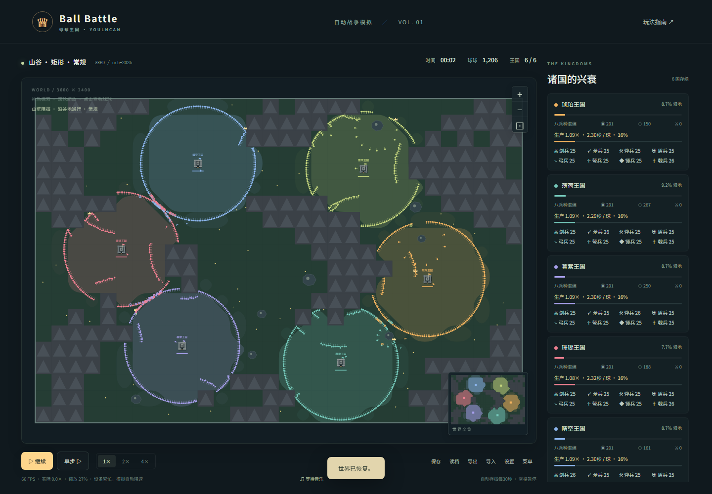

# Ball Battle（球球王国）

[立即游玩](https://youlncan.github.io/ball-battle/) · [源码仓库](https://github.com/YOULNCAN/ball-battle)



由 YOULNCAN 发布的中文浏览器自动战争模拟，使用 TypeScript + Vite + Canvas 2D。无需服务器或账号。

## 启动

需要 Node.js 20.19+ 或22.12+，当前依赖已安装。

```powershell
git clone https://github.com/YOULNCAN/ball-battle.git
cd ball-battle
npm.cmd ci
npm.cmd run dev -- --port 5173 --strictPort
```

开发地址：<http://127.0.0.1:5173/>。

```powershell
npm.cmd run build
npm.cmd run preview -- --port 4173 --strictPort
```

生产预览地址：<http://127.0.0.1:4173/>。保留原主机名和端口，避免改变浏览器存档所属地址。

## 玩法

- 默认6国、每国200球、人口上限2000；每国兵力相同，总数必须至少20且不超过上限。支持2–8国，上限100–4000。
- 所有城堡同时360度爆发出兵；招募也从城堡射出。3秒双倍速冲锋带拖尾，忽略友军和本城堡碰撞，仍可攻击敌人。
- 拖动、滚轮控制镜头；点击球或城堡查看详情；小地图定位。空格暂停，方向键移动，F全图，+ / −缩放。
- 普通战斗友军无伤，敌军互伤；击杀升级、变大并获得技能。国王死亡由最高等级士兵继任。
- 城堡每秒产出2资源，18资源招募一球；间隔为 `2.5秒 / (1 + 本国领地比例)`，最低1.25秒，最多2倍速度。领地比例仅计可占领地块。逐模拟步累积进度，资源不足或人口已满最多保留一次待招募，不积累爆发补兵。面板显示倍率、间隔和进度。
- 普通球新局和招募时统一为1级、零经验、无技能：半径6、质量0.6、生命112、速度75、攻击8、防御2。兵种差异由武器规则体现，战斗后照常成长。新局国王生命1.8倍、攻击1.2倍，继任沿用原规则。
- 地块停留占领，多国共处暂停。水域和山壁不参与占领；最后一国自动收拢剩余领地并结算。

## 武器

每国拥有八种兵种，初始兵力包含国王并尽量均分，余数按剑、矛、斧、盾、弓、弩、锤、戟的顺序分配。默认每国200球，每种25球；每国至少8球，初始总数仍至少20。国王随机携带一种武器。招募优先补充本国存活人数最少的兵种，并列时种子随机选择。球自动攻击最近敌人，仍直线运动和反弹；征服后已有球保留兵种。

国王拥有“王者战意”：生命低于30%时，每次任职触发一次5秒战意，受到的伤害系数为60%、攻击提升25%，显示金色光环。继任者重新获得触发机会。范围攻击最多命中4个最近目标，倍率按目标数平方根分摊；近战重击倍率1.25，碰撞重击1.4，降低技能叠加优势。

| 武器 | 球体边缘外射程 | 间隔 | 倍率 | 特性 |
| --- | ---: | ---: | ---: | --- |
| 剑 | 26 | 0.55秒 | 1.0 | 单体快砍 |
| 长矛 | 58 | 0.9秒 | 1.2 | 单体突刺 |
| 战斧 | 40 | 1.5秒 | 1.55 | 108度扇形 |
| 盾牌 | 碰撞 | 碰撞冷却 | 1.35 | 正面伤害降至55% |
| 弓 | 260 | 1.3秒 | 0.72 | 550速度箭矢 |
| 弩 | 330 | 2.5秒 | 1.65 | 720速度箭矢 |
| 战锤 | 26 | 1.8秒 | 1.15 | 周围震荡，55速度击退 |
| 长戟 | 50 | 1.4秒 | 1.1 | 180度扫击 |

武器和碰撞冷却独立，护盾、重击、吸血同样生效。箭矢按移动线段命中第一个敌人，穿过友军与水域，遇树木、岩石、山壁、边界或射程耗尽消失；可攻击敌方城堡。

## 地图与原创音乐

地图可指定或随机，默认随机。所有城堡之间有宽通路。

形状可选矩形或圆形，默认矩形。圆形半径1140，城堡沿圆环分布，球在圆周按法线反弹，圆外为暗色背景，不可进入或占领，不生成资源和障碍。六类地形都可搭配常规、中央湖泊、中央竞技场布局：湖泊阻挡球而允许箭矢越过，竞技场中央开阔并用宽通道连接城堡。形状、布局与种子共同决定世界。

障碍只在新地图生成时按种子随机放置，生成及通路修复后进行安全撒点和连通性检查；同一种子和设置可复现，不随游戏时间凭空出现，旧档不重建障碍。城堡为统一造型的石墙、四角塔楼、庭院、城门和阵营旗帜，远景简化；保留王国名称及生命条，删除地图城堡下方的“八兵种混编”。

- 草原：正常通行，少量岩石。
- 沙漠：沙地70%移动速度，沙丘阻挡。
- 雪原：冰面保持慢速滑行，最大基础速度230。
- 森林：林地65%移动速度，树木阻挡球和箭。
- 山谷：山壁阻挡，宽通道连接诸国。
- 群岛：水岸反弹，桥梁连接岛屿，箭矢可越水。

八首本地原创纯器乐MP3由ElevenLabs Music v2生成：六首地图曲、一首激战曲（各约60秒）及20秒胜利曲。素材位于 `public/music/`，生成来源记录见 `sources.json`。运行时不调用生成服务或加载远程音频。

地图曲循环在解码缓冲内做2秒头尾交叉淡化，切换曲目平滑淡化。敌对命中达到30次/真实秒并持续3秒可进入激战，低于10次/秒持续10秒可退出，切换间隔至少20秒。倍速不改变音乐速度。音乐默认25%、音效默认20%，独立控制；暂停、普通菜单遮罩和页面隐藏时暂停续播，结算播放胜利曲。

## 存档

网页版与本地版属于不同网站地址，浏览器存档不会自动共享。从本地导出 JSON，再到网页版导入即可继续原来的世界。游戏存档仅保存在玩家自己的浏览器，不上传到 GitHub。

数据库仍为 `ball-kingdom`，手动、自动各一槽。每30秒、返回菜单、页面隐藏和结算时尝试自动保存。强制关闭浏览器不保证即时保存，请手动保存或导出JSON。

版本5新增爆炸与火圈的位置、模拟时间和灼烧进度，保留每国招募进度，包含地图形状、布局、国王技能状态，以及地形、兵种、冲锋、攻击冷却、在途箭矢及归属和RNG状态。文件上限12MB，导入校验成功才替换当前世界。

版本1、2先按原约束校验并执行八兵种迁移；版本3保留当前兵种、形状和布局。版本1–3的普通球首次升级时重置到基础属性，保留受伤比例、位置、方向、身份、阵营、武器、击杀记录和出堡冲锋，清除经验、技能、临时护盾和战意；当前国王不重置。地图、领地、资源、历史、原障碍和在途箭矢的原攻击数据保留，迁移不消耗世界RNG。旧招募剩余时间按2.5秒基准换算成进度。升级成功提示并写回新版；版本4及5读档不再重置，可继续积累成长。版本1仍按草原、矩形、常规布局处理，版本2保持矩形和原地形。

存档属于当前浏览器及网站地址；更换浏览器、主机名、端口或清理网站数据会影响槽位。JSON可跨地址恢复。音乐播放对象不写入世界存档。

## 验证

```powershell
npm.cmd test
npm.cmd run test:browser
npm.cmd run test:upgrade
npm.cmd run test:mixed
npm.cmd run test:land-production
npm.cmd run test:balance
npm.cmd run test:pressure
npm.cmd run test:war-pressure
npm.cmd run test:production
```

首次浏览器测试需 `npx.cmd playwright install chromium`。开发测试需要5173服务器，`ORB_URL`可覆盖；生产测试需要4173预览服务器，`ORB_PREVIEW_URL`可覆盖。压力测试建议单独运行。

圆形竞技场压力测试：设置 `$env:ORB_SHAPE='circle'`、`$env:ORB_LAYOUT='arena'` 后运行 `npm.cmd run test:war-pressure`。`ORB_SCENARIOS` 可用逗号限定场景；测试后移除这些环境变量恢复默认。原始性能记录按形状与布局分别保存。

固定1/30秒步长，空间网格处理碰撞、目标搜索和箭矢命中；每帧预算约9毫秒，最多10步。繁忙时降低实际模拟速度；画质只改变绘图，不改变伤害，特效上限220。

验证记录见 `VALIDATION.md`，原始指标与截图在被git忽略的 `test-results/`。桌面Chromium已验证，其他浏览器与移动端未专项适配。

## 爆炸与领地显示

- 国王及继任者死亡：半径150、80固定伤害，立即连锁，每位只爆炸一次。
- 城堡陷落立即归并：半径140、80固定伤害爆炸；0.8秒后形成半径110火圈，持续15秒，每0.5秒6固定伤害，最后3秒逐渐熄灭。
- 爆炸和火圈仅伤及敌我球球，不损伤城堡；山壁遮挡伤害。无环境击杀经验奖励，死亡仍留下资源。火圈不阻挡移动。暂停冻结模拟，倍速同步推进，统一结算时冻结。
- 地图和小地图使用缓存平滑轮廓显示连续阵营区域，无方格边线；水域、山壁与圆外不显示占领区域。原占领、领地比例与招募算法保持。
- 版本1–4升级至5不补发历史爆炸，版本4保留成长；新版保存火圈与爆炸状态，导入失败保留当前世界。
- 新增专项检查：`node tests/hazards-browser.mjs`。

## 发布与许可证

代码和文档使用 [MIT 许可证](LICENSE)，Copyright © 2026 YOULNCAN。八首音乐已获项目所有者确认允许随本游戏公开分发，独立于代码的 MIT 授权，详见 [音乐说明](public/music/NOTICE.md)。

推送到 `main` 后，GitHub Actions 使用 Node.js 24 安装依赖、运行模拟测试及类型检查，并构建部署至 GitHub Pages。PR 只检查，不部署；Actions 页面也可手动运行发布工作流。

构建发布版：`npm run build:pages`；本地开发仍使用 `npm run dev`。发布版的资源基础路径为 `/ball-battle/`，使用 `npm run preview -- --mode pages` 预览，并访问 `http://127.0.0.1:4173/ball-battle/`。
